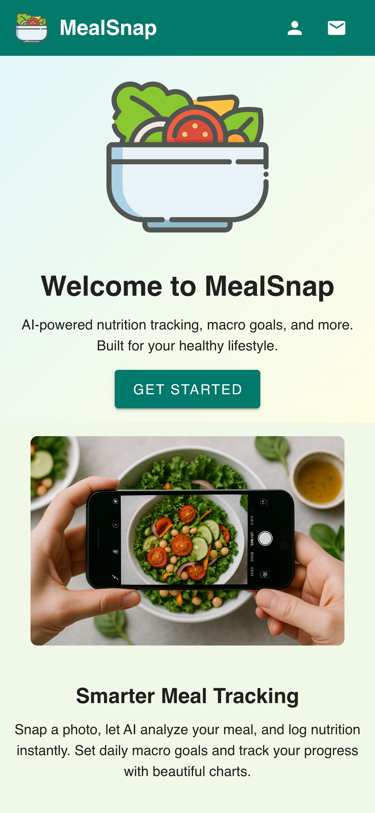
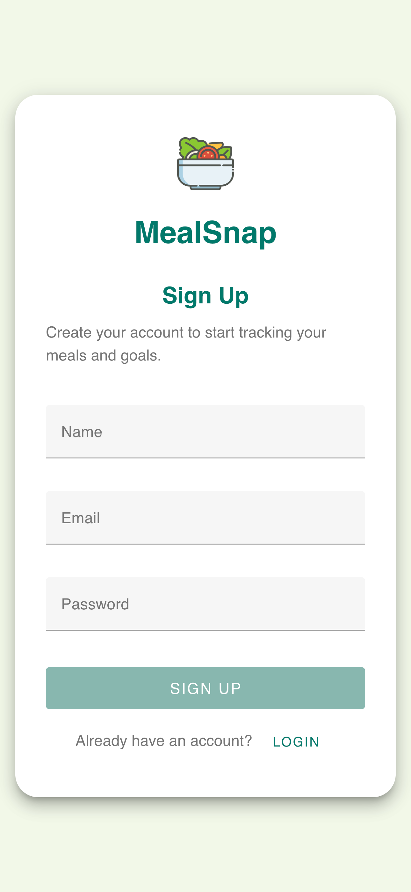
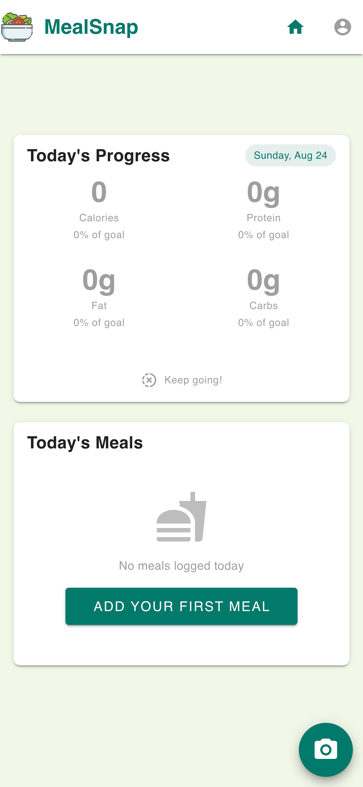
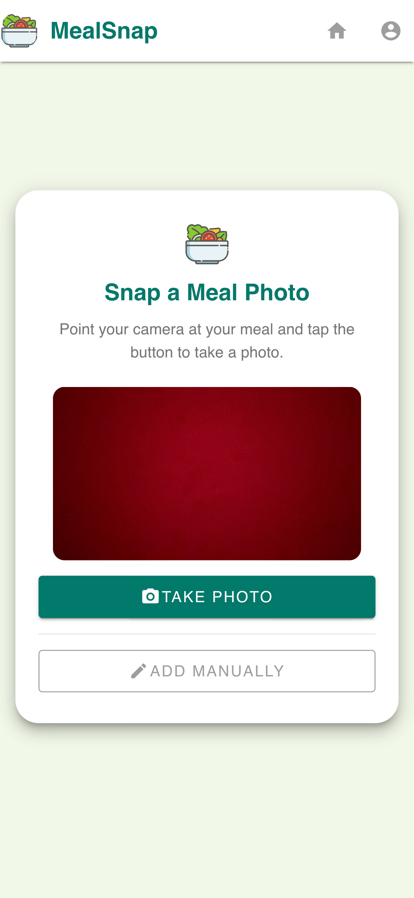
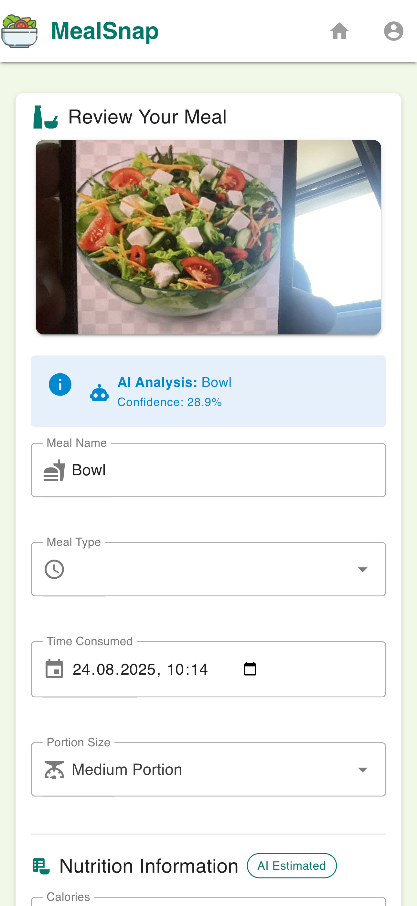
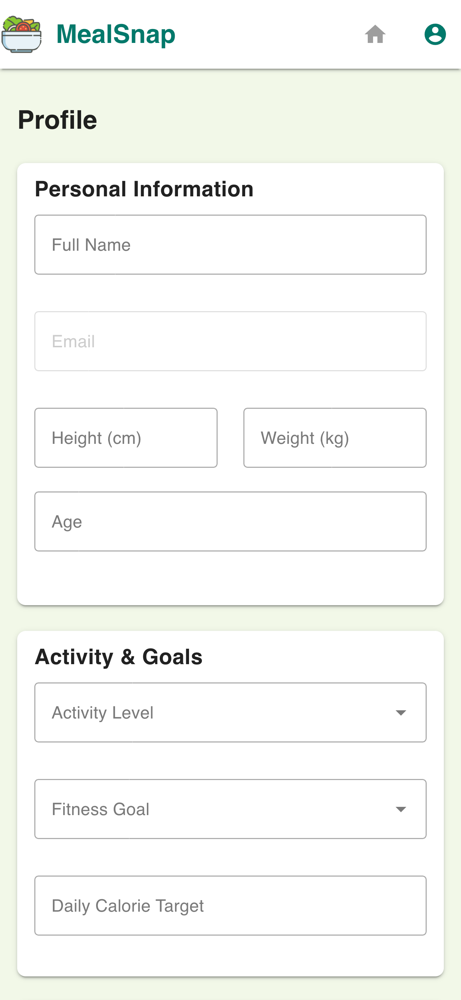

# 🥗 MealSnap - AI-Powered Nutrition Tracker

<div align="center">


**A modern full-stack web application for intelligent meal tracking and nutrition analysis**

[](https://www.typescriptlang.org/)
[](https://nuxt.com/)
[](https://vuejs.org/)
[](https://supabase.io/)
[](https://www.tensorflow.org/js)

[🚀 Live Demo](#) | [📖 Documentation](#setup) | [🛠️ Installation](#installation)

</div>

---

## ✨ Features

🔐 **Secure Authentication** - Complete user registration and login system with Supabase Auth  
📸 **AI Food Classification** - Analyze food photos using TensorFlow.js models locally in your browser  
🍱 **Smart Meal Tracking** - Log meals with detailed macro and calorie breakdowns  
🎯 **Personalized Goals** - Set and track daily nutrition targets (calories, protein, carbs, fats)  
📊 **Progress Dashboard** - Beautiful visualizations of your nutrition progress  
📱 **Mobile-First Design** - Responsive interface optimized for all devices  
🔒 **Privacy-Focused** - Local AI processing means your food photos never leave your device

---

## 🏗️ Architecture & Tech Stack

### Frontend

- **[Nuxt 3](https://nuxt.com/)** - Full-stack Vue framework
- **[Vue 3](https://vuejs.org/)** - Progressive JavaScript framework
- **[Vuetify 3](https://vuetifyjs.com/)** - Vue Material Design components
- **[TypeScript](https://www.typescriptlang.org/)** - Type-safe development

### Backend & Database

- **[Supabase](https://supabase.io/)** - PostgreSQL database with real-time subscriptions
- **Supabase Auth** - User authentication and authorization
- **Supabase Storage** - Image storage for meal photos
- **Row Level Security (RLS)** - Database-level security policies

### AI & Machine Learning

- **[TensorFlow.js](https://www.tensorflow.org/js)** - Local food classification
- **MobileNetV2** - Efficient image classification model
- **COCO-SSD** - Object detection for food items
- **[Hugging Face](https://huggingface.co/)** - Optional fallback API for enhanced accuracy

### Development Tools

- **ESLint + Prettier** - Code formatting and linting
- **TypeScript** - Static type checking
- **Nuxt DevTools** - Enhanced development experience

---

## 📱 Screenshots

### 🏠 Landing Page

<div align="center">

<p><em>Clean, modern landing page with call-to-action</em></p>
</div>

### 🔐 User Registration

<div align="center">

<p><em>Secure user registration with Supabase Auth</em></p>
</div>

### 📊 Dashboard & Progress Tracking

<div align="center">

<p><em>Real-time nutrition tracking with visual progress indicators</em></p>
</div>

### 📸 AI-Powered Food Scanner

<div align="center">


<p><em>TensorFlow.js powered local food classification</em></p>
</div>

### 👤 User Profile Management

<div align="center">

<p><em>Complete profile management and account settings</em></p>
</div>

---

## 🚀 Installation

### Prerequisites

- Node.js 18+
- npm or yarn
- Supabase account (free tier available)

### Quick Start

```bash
# Clone the repository
git clone https://github.com/mertaksehirlioglu/my-meal-tracker.git
cd my-meal-tracker

# Install dependencies
npm install

# Copy environment template
cp .env.example .env

# Configure your environment variables (see below)

# Run database migrations (optional - handled automatically)
npm run dev
```

### Environment Configuration

Create a `.env` file with the following variables:

```env
# Supabase Configuration
SUPABASE_URL=https://your-project.supabase.co
SUPABASE_KEY=your-anon-key
SUPABASE_SERVICE_ROLE_KEY=your-service-role-key

# Storage Configuration
SUPABASE_MEAL_IMAGES_BUCKET=meal-images

# Contact Configuration
VITE_CONTACT_MAIL=your-email@example.com
```

### Supabase Setup

1. Create a new project at [supabase.com](https://supabase.com)
2. Run the SQL migrations from `server/database/migrations/`
3. Enable Row Level Security on all tables
4. Create a storage bucket named `meal-images`
5. Copy your project credentials to `.env`

---

## 🎯 Key Features Showcase

### 🤖 AI-Powered Food Recognition

- **Local Processing**: Uses TensorFlow.js for privacy-focused food classification
- **No API Calls**: All image processing happens in your browser
- **Fallback Support**: Optional Hugging Face integration for enhanced accuracy
- **Smart Nutrition Mapping**: Automatically estimates calories and macros

### 📊 Comprehensive Tracking

- **Daily Progress**: Visual progress bars for calories and macronutrients
- **Meal History**: Detailed log of all tracked meals
- **Goal Management**: Customizable daily nutrition targets
- **Progress Charts**: Beautiful visualizations of your nutrition journey

### 🔒 Security & Privacy

- **Row Level Security**: Database-level data isolation
- **Secure Authentication**: JWT-based auth with Supabase
- **Local AI Processing**: Food photos never leave your device
- **GDPR Compliant**: Full data control and export capabilities

---

## 🛠️ Development

### Available Scripts

```bash
# Development
npm run dev          # Start development server
npm run build        # Build for production
npm run preview      # Preview production build

# Code Quality
npm run typecheck    # TypeScript type checking
npm run lint         # ESLint code linting
npm run lint:fix     # Auto-fix ESLint issues
npm run format       # Format code with Prettier
npm run check        # Run all checks (typecheck, lint, format)
```

### Project Structure

```
├── components/           # Reusable Vue components
├── composables/         # Vue composition functions
├── layouts/             # Application layouts
├── lib/                # Utility libraries and AI providers
├── middleware/          # Route middleware
├── pages/              # File-based routing
├── plugins/            # Nuxt plugins
├── server/             # Server API routes and database
├── public/             # Static assets
└── types/              # TypeScript type definitions
```

---

## 🚀 Deployment

### Recommended Platforms

**[Vercel](https://vercel.com/)** (Recommended)

```bash
npm run build
# Deploy to Vercel with zero configuration
```

**[Netlify](https://netlify.com/)**

```bash
npm run generate
# Deploy static site to Netlify
```

### Environment Variables for Production

Ensure all production environment variables are configured in your hosting platform.

---

## 🎨 Design Philosophy

### User Experience

- **Mobile-First**: Designed for on-the-go meal tracking
- **Intuitive Interface**: Clean, Material Design-inspired UI
- **Fast Performance**: Optimized for quick meal logging
- **Accessibility**: WCAG compliant design patterns

### Technical Philosophy

- **Privacy by Design**: AI processing happens locally
- **Progressive Enhancement**: Works without JavaScript for core features
- **Type Safety**: Full TypeScript coverage
- **Modern Standards**: Latest web technologies and best practices

---

## 🤝 Contributing

Contributions are welcome! Please feel free to submit a Pull Request. For major changes, please open an issue first to discuss what you would like to change.

### Development Guidelines

- Follow the existing code style (ESLint + Prettier)
- Add TypeScript types for all new code
- Write descriptive commit messages
- Test your changes thoroughly

---

## 📄 License

This project is licensed under the MIT License - see the [LICENSE](LICENSE) file for details.

---

## 👨‍💻 Author

**Mert Akşehirlioglu**

- GitHub: [@mertaksehirlioglu](https://github.com/mertaksehirlioglu)
- Email: mertaksehirlioglu@hotmail.com

---

<div align="center">

**Built with ❤️ for a healthier lifestyle**

[⭐ Star this repo](https://github.com/mertaksehirlioglu/my-meal-tracker) | [🐛 Report Bug](https://github.com/mertaksehirlioglu/my-meal-tracker/issues) | [💡 Request Feature](https://github.com/mertaksehirlioglu/my-meal-tracker/issues)

</div>
